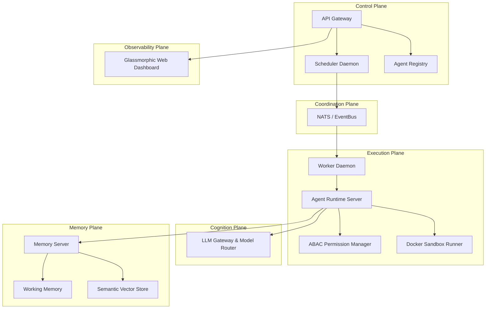

# AgentOS 🧠🤖

### The Operating System for Autonomous AI Agents

AgentOS is a robust, lightweight, and extensible runtime platform designed to deploy, run, and scale autonomous AI agents with the same operational maturity that Kubernetes brought to containerized microservices. 

Rather than modeling agents as simple application code or standard function calls, AgentOS treats them as **first-class managed resources** with declared manifests, isolated tool permission scopes, multi-tier state checkpointing, and infrastructure-managed memory.

---

## 🏛️ System Architecture

AgentOS is split into decoupled microservice planes communicating via **gRPC** and coordinated via **NATS** event queues:



*   **Registry Plane**: Stores declarative agent manifest models and versions.
*   **Execution Plane**: Evaluates tool limits via ABAC Policies and isolates shell/file actions inside temporary Alpine Docker containers.
*   **Cognition Plane**: Dynamically routes LLM API completions and tracks token metrics.
*   **Memory Plane**: Manages state layers including working context summary compression and vector similarity search.
*   **Coordination Plane**: Manages task priority schedules and distributes queues asynchronously.
*   **Observability Plane**: Provides trace span visualizations and token/USD cost metrics via a Web Dashboard.

---

## 🚀 Key Tenets

1.  **Agents are First-Class Resources**: Scheduled and secured dynamically using declarative `AgentManifest` schemas (analogous to Kubernetes Pod specifications).
2.  **Memory as Infrastructure**: Agents never interface with raw storage. Working, episodic, and semantic vector tiers are provided natively by the operating system.
3.  **Least-Privilege Security Model (ABAC)**: Checks manifest scopes, blocks path traversals, and enforces static parameter analysis to deny shell injections.
4.  **Durable Checkpointing**: Agent state is serialized and checkpointed after each reasoning step, allowing resume/recovery on failure without re-running execution paths.
5.  **Micro-VM Container Sandbox**: Restricts tool runs inside Alpine Docker containers with network disabled and memory/CPU caps enforced.

---

## 📦 Directory Structure

```text
agentos/
├── api/
│   ├── templates/
│   │   └── dashboard.html    # Premium glassmorphic telemetry dashboard UI
│   └── server.py             # FastAPI REST Gateway, stats APIs, and tracing routes
├── cmd/                      # Application binaries/scripts
├── core/
│   ├── manifest/
│   │   └── models.py         # AgentManifest declarative validation schemas
│   ├── scheduler/
│   │   └── scheduler.py      # Priority task scheduler daemon listening to Event Bus
│   ├── security/
│   │   └── permission_manager.py # ABAC security policy enforcer
│   └── event_bus.py          # NATS EventBus client with dual-mode in-memory fallback
├── cognition/
│   ├── gateway/
│   │   └── llm.py            # Unified LLM provider gateway (OpenAI, Anthropic, Gemini, Mistral)
│   └── server.py             # Cognition Plane gRPC Server (port 50051)
├── execution/
│   ├── runtime/
│   │   ├── engine.py         # Reasoning execution engine loop and checkpoint manager
│   │   └── server.py         # Agent Runtime Plane gRPC Server (port 50054)
│   ├── sandbox/
│   │   └── runner.py         # Docker container task file/command execution sandbox
│   └── worker_daemon.py      # Worker daemon consuming tasks and invoking execution planes
├── memory/
│   ├── engine.py             # Working memory compression & pure-Python vector search
│   └── server.py             # Memory Plane gRPC Server (port 50052)
├── core/registry/
│   └── server.py             # Registry Plane gRPC Server (port 50053)
├── protos/
│   ├── agentos.proto         # Protobuf contracts for all gRPC service interfaces
│   ├── loader.py             # Programmatic proto compiling bootloader
│   └── [generated_bindings]  # Generated python grpc code
├── compile_protos.py         # Manual protobuf compiler tool
├── storage/
│   └── database.py           # SQLAlchemy SQLite backend database schema
├── test_integration.py       # Distributed integration & security enforcer tests
├── test_workflow.py          # DAG workflow orchestration test suite
└── requirements.txt          # Package dependencies
```

---

## 🛠️ Getting Started (Local Setup)

### 1. Prerequisites
Ensure you have `Python 3.10+` and `uv` (or `pip`) installed.

### 2. Environment Configuration
Create a virtual environment and install dependencies:
```powershell
# Create venv using uv
uv venv

# Activate virtualenv (Windows)
.venv\Scripts\Activate.ps1

# Install requirements
uv pip install -r requirements.txt
```

Set your LLM provider API keys as environment variables:
```powershell
$env:OPENAI_API_KEY="your-openai-key"
$env:GEMINI_API_KEY="your-gemini-key"
```
*(If no API keys are provided, the platform automatically falls back to an intelligent, local mock engine for testing).*

---

## 🧪 Running Tests

### 1. Distributed Integration Tests
Executes Registry, Cognition, Memory, and Runtime servers, NATS daemons, NATS in-memory fallback queues, and evaluates ABAC policies against unauthorized shell injections:
```powershell
python test_integration.py
```
Upon success, you will see:
```text
DISTRIBUTED INTEGRATION TESTS PASSED! ✅
```

### 2. DAG Workflow Engine Tests
Executes multi-step agent pipelines declared in YAML, resolving output dependencies and passing variables:
```powershell
python test_workflow.py
```
Upon success, you will see:
```text
WORKFLOW ENGINE INTEGRATION TEST PASSED! ✅
```

---

## 📊 Telemetry Web Dashboard

1.  Start the FastAPI server:
    ```powershell
    uvicorn api.server:app --reload
    ```
2.  Open your browser and navigate to:
    [http://localhost:8000/dashboard](http://localhost:8000/dashboard)

The UI displays real-time execution statistics, token spend pools, task queues, visual tracing span logs, and durable DB state checkpoints.
