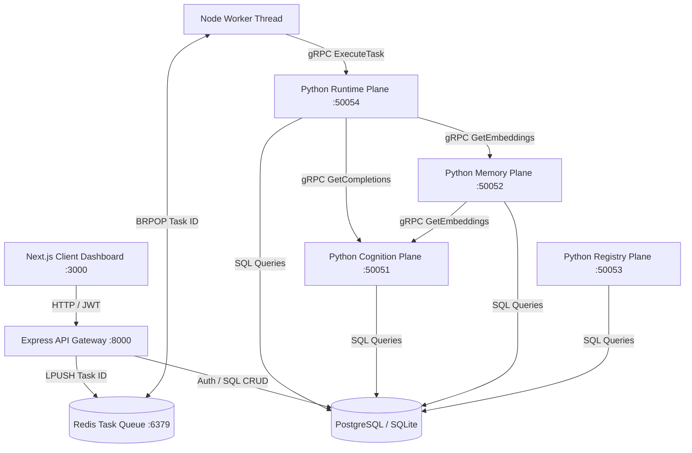

# AgentOS 🧠🤖

### Enterprise-Grade Multi-Tenant Operating System for Autonomous AI Agents

AgentOS is a robust, distributed runtime orchestration platform designed to deploy, isolate, and scale autonomous AI agents with the same operational maturity that Kubernetes brought to containerized microservices. 

Rather than modeling agents as simple application scripts or basic wrapper functions, AgentOS treats them as **first-class managed infrastructure** with declared manifests, user-scoped authentication, isolated containerized tool runs, multi-tier state checkpointing, and real-time distributed tracing.

---

## 🏛️ System Architecture

AgentOS is built using a modern **Next.js** frontend, a **Node/Express** API Gateway, a high-performance **Redis FIFO queue**, and four decoupled **Python gRPC planes** writing to a shared relational database (**PostgreSQL/SQLite**).



### 🛰️ The Decoupled Planes
1.  **Registry Plane**: Manages declarative agent manifest models and versions (`protos/agentos.proto` -> port `50053`).
2.  **Cognition Plane**: Dynamically routes LLM API completions and tracks token metrics (port `50051`).
3.  **Memory Plane**: Manages episodic memory summaries and executes vector similarity searches for context retrieval (port `50052`).
4.  **Runtime Plane**: Houses the agent reasoning loops, intercepts tool calls, and checkpoints state (port `50054`).

---

## 🔒 Key Enterprise Features

### 1. Multi-Tenant User Authentication (JWT)
The system isolates resources using token authorization. Users register and login via the Express Gateway. Every agent instance, task submission, and execution span is bound to the owner's `user_id`, meaning **User A can never inspect or execute tasks belonging to User B**.

### 2. Low-Level Redis FIFO Queue System
To avoid network bottlenecks and ensure heavy reasoning runs do not block the HTTP threads, AgentOS implements a low-level queue system:
*   Express pushes tasks to a Redis List using `LPUSH agentos:queue`.
*   A lightweight Node background worker monitors the list using `BRPOP agentos:queue 0`, popping jobs instantly and executing them over gRPC.

### 3. Micro-VM Sandbox Isolation
Tools invoked by the agent execute in temporary, isolated Alpine Docker containers with:
*   **Disabled Network Interfaces** (preventing prompt leaks and unauthorized data egress).
*   **256MB memory caps** and **1 CPU core limit** (preventing denial-of-service loops).
*   *Fallbacks to OS subprocess environments if Docker is unavailable.*

### 4. Attribute-Based Access Control (ABAC)
Before any tool is executed inside the sandbox, the ABAC enforcer checks the agent's manifest permissions, blocking:
*   **Directory Traversals**: Blocked if pathways contain `../` or access restricted system root logs.
*   **Shell Injection metacharacters**: Blocked if command arguments contain `; & |`.
*   **Forbidden execution binaries**: Denies binaries like `sudo`, `rm`, and direct terminal shells.

### 5. Durable State Checkpointing
The agent's memory and working states are serialized and checkpointed to database records after *each reasoning step*. If a worker node crashes mid-execution, the Scheduler will re-route the task, and the worker will resume dynamically from the last saved state without repeating costly LLM cycles.

---

## 📦 Directory Structure

```text
agentos/
├── server-node/          # Node/Express Auth & Redis Gateway
│   ├── db.js             # Sequelize ORM schema declarations (User, Task, Checkpoint, etc.)
│   ├── Dockerfile        # Container specifications for node API
│   ├── package.json      # Node dependencies
│   └── server.js         # Express endpoints, JWT auth, and Redis worker queue
├── web/                  # Next.js Frontend Dashboard Client
│   ├── src/app/
│   │   ├── page.js       # Premium glassmorphic telemetry dashboard page
│   │   ├── login/        # Login page
│   │   ├── register/     # Registration page
│   │   ├── layout.js     # Root React metadata & font injectors
│   │   └── globals.css   # Orange/peach styling specifications
│   ├── Dockerfile        # Next.js development client container
│   └── package.json      # Frontend client dependencies
├── core/
│   ├── manifest/         # AgentManifest declarative models
│   ├── scheduler/        # Legacy NATS-based scheduler
│   ├── security/         # ABAC policy enforcer rules
│   └── event_bus.py      # Event bus interface
├── cognition/            # Python Cognition gRPC Plane (Port 50051)
├── memory/               # Python Memory gRPC Plane (Port 50052)
├── execution/            # Python Runtime gRPC Plane (Port 50054)
│   └── sandbox/          # Docker tool isolation runner
├── storage/              # Database adapter models & connection logic
├── protos/               # gRPC protobuf contract definitions
├── docker-compose.yml    # Orchestrates local PostgreSQL, Redis, Next.js, Express, and gRPC planes
└── requirements.txt      # Python dependencies
```

---

## 🚀 How to Run the Project

You can boot up the entire multi-tenant stack with one command utilizing `docker-compose`.

### Prerequisites
*   [Docker](https://docs.docker.com/get-docker/) & Docker Compose installed.

### Setup Steps
1.  **Configure API Keys**: Create a `.env` file in the root directory to store your LLM keys:
    ```env
    OPENAI_API_KEY=your_openai_key
    GEMINI_API_KEY=your_gemini_key
    ANTHROPIC_API_KEY=your_anthropic_key
    ```
2.  **Start the Cluster**:
    ```bash
    docker-compose up --build
    ```
    This builds the images, sets up the database structures, starts PostgreSQL, connects Redis, and spins up the Next.js client.

3.  **Access the Dashboard**:
    *   Open your browser to: **[http://localhost:3000](http://localhost:3000)**.
    *   Register a new Operator profile, then login.
    *   You will land on the peach-orange glassmorphism dashboard showing 0 stats.
    *   **Trigger a task**: Type a query in the input box (e.g. `Please optimize TSLA portfolio weights`) and click **Dispatch**!
    *   Watch the Redis worker capture the task, send it to the gRPC Python runtime, and reconstruct the distributed tracing spans live on your screen!

---

## 🧪 Testing the Codebase

To run unit and integration tests (which verify the ABAC security layers and gRPC plane functionality):

1.  Set up your local python virtual environment:
    ```bash
    python -m venv .venv
    .venv\Scripts\activate   # On Windows
    source .venv/bin/activate # On Unix/macOS
    pip install -r requirements.txt
    ```
2.  Compile gRPC definitions:
    ```bash
    python compile_protos.py
    ```
3.  Run the integration test suite:
    ```bash
    python test_integration.py
    python test_workflow.py
    ```
