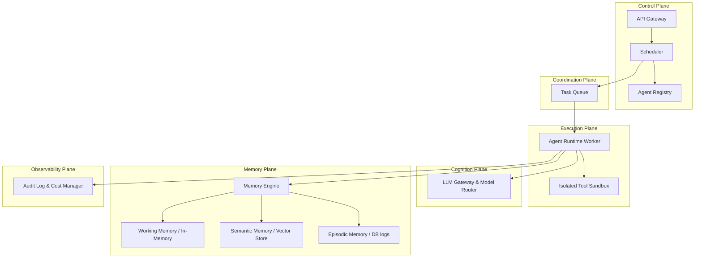

# AgentOS 🧠🤖

### The Operating System for Autonomous AI Agents

AgentOS is a robust, lightweight, and extensible runtime platform designed to deploy, run, and scale autonomous AI agents with the same operational maturity that Kubernetes brought to containerized microservices. 

Rather than modeling agents as simple application code or standard function calls, AgentOS treats them as **first-class managed resources** with declared manifests, isolated tool permission scopes, multi-tier state checkpointing, and infrastructure-managed memory.

---

## 🏛️ System Architecture

AgentOS is built around six logical planes, decoupling cognition, execution, and memory to allow scaling each dimension independently:



*   **Control Plane**: Resolves authentication, parses declarative manifests, manages version registries, and handles scheduling.
*   **Execution Plane**: Isolates reasoning runtimes and sandboxes tool actions to secure system side effects.
*   **Cognition Plane**: Dynamically routes LLM API completions and tracks token budgets.
*   **Memory Plane**: Automatically manages working context (including auto-compression summaries) and vector semantic search.
*   **Coordination Plane**: Manages state queues and event coordination.
*   **Observability Plane**: Records full audit trails of tool executions and tracks token spend.

---

## 🚀 Key Tenets

1.  **Agents are First-Class Resources**: Scheduled and secured dynamically using declarative `AgentManifest` schemas (analogous to Kubernetes Pod specifications).
2.  **Memory as Infrastructure**: Agents never interface with raw storage. Working, episodic, and semantic vector tiers are provided natively by the operating system.
3.  **Least-Privilege Security Model**: Strict boundary enforcement scopes precisely which tools an agent can invoke, intercepting and auditing every action.
4.  **Durable Execution & Checkpointing**: Agent state is serialized and checkpointed to database records after each step. In case of network drops or runtime crashes, agents resume automatically from their last checkpoint without replaying the entire history.

---

## 📦 Directory Structure (Milestone 1 MVP)

```text
agentos/
├── api/
│   └── server.py             # FastAPI REST Gateway (Manifests, Tasks, Semantic search)
├── cmd/                      # Application binaries/scripts
├── core/
│   ├── manifest/
│   │   └── models.py         # AgentManifest declarative validation schemas
│   └── scheduler/
│       └── scheduler.py      # Priority-queue task scheduler (high > medium > low)
├── cognition/
│   └── gateway/
│       └── llm.py            # Unified LLM provider gateway (OpenAI, Anthropic, Gemini, Mistral)
├── execution/
│   ├── runtime/
│   │   └── engine.py         # Reasoning execution engine loop and checkpoint manager
│   └── sandbox/
│       └── runner.py         # Scoped task folder file sandbox & tool runner
├── memory/
│   └── engine.py             # Working memory compression & pure-Python vector search
├── storage/
│   └── database.py           # SQLAlchemy SQLite backend definitions & migrations
├── test_integration.py       # End-to-end test suite
└── requirements.txt          # Package dependencies
```

---

## 🛠️ Getting Started (Local Setup)

### 1. Prerequisites
Ensure you have `Python 3.10+` and `uv` (or `pip`) installed.

### 2. Environment Configuration
Create a virtual environment and install the required dependencies:
```powershell
# Create venv using uv
uv venv

# Activate virtualenv (Windows)
.venv\Scripts\Activate.ps1

# Install requirements
pip install -r requirements.txt
```

Set your LLM provider API keys as environment variables:
```powershell
$env:OPENAI_API_KEY="your-openai-key"
$env:MISTRAL_API_KEY="your-mistral-key"
$env:GEMINI_API_KEY="your-gemini-key"
```
*(If no API keys are provided, the platform automatically falls back to an intelligent, local deterministic mock engine for testing).*

### 3. Run Automated Integration Tests
Verify manifest registrations, state checkpoint sequences, tool denials, and similarity search queries by running the test suite:
```powershell
python test_integration.py
```
Upon successful completion, you will see:
```text
ALL INTEGRATION TESTS PASSED SUCCESSFULLY! ✅
```

### 4. Start the API Server Gateway
Run the local FastAPI server to start registering manifests and queueing tasks:
```powershell
uvicorn api.server:app --reload
```
Open [http://localhost:8000/docs](http://localhost:8000/docs) in your browser to interact with the system using Swagger UI.
