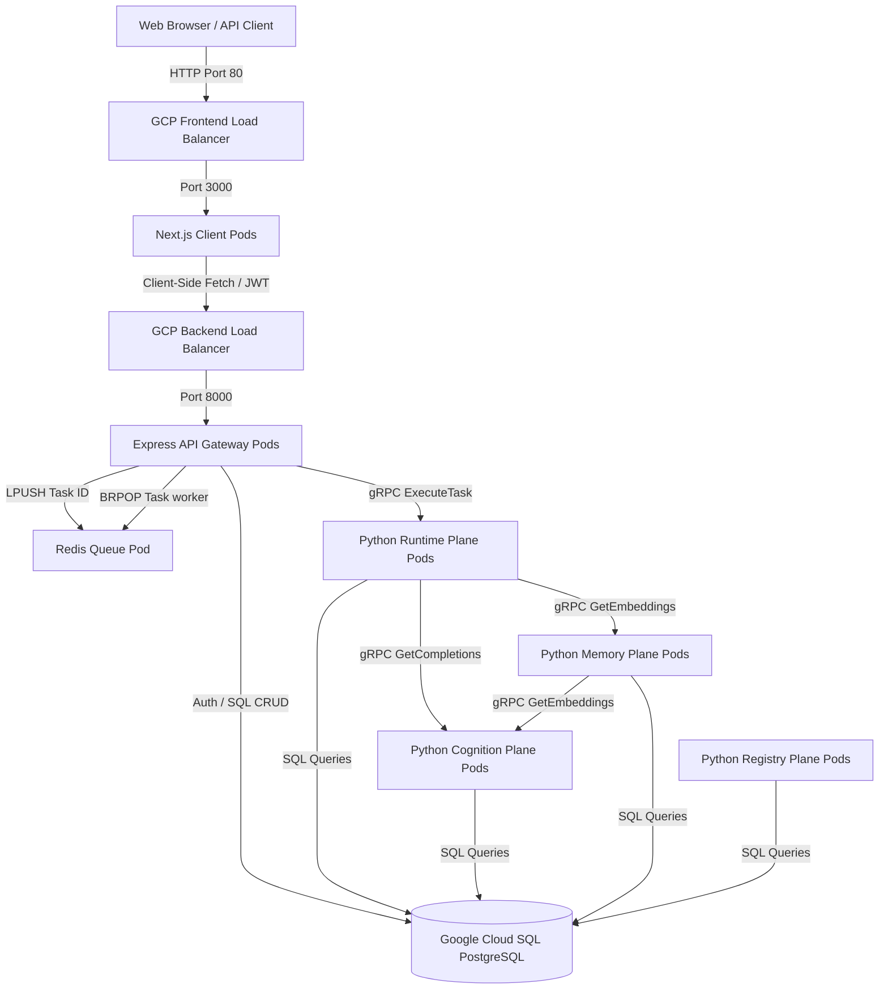

# Deploying AgentOS on Google Cloud Platform (GCP)

This guide walks you through deploying the production-ready AgentOS distributed microservices cluster onto **Google Kubernetes Engine (GKE)** with **Google Cloud SQL (PostgreSQL)**, **Google Artifact Registry (GAR)**, and **Redis**.

---

## Architecture Overview



---

## Step 1: Prerequisites & GCP Project Setup

1. Install the [Google Cloud SDK](https://cloud.google.com/sdk/docs/install) and `kubectl`.
2. Authenticate and configure your active project:
   ```bash
   gcloud auth login
   gcloud config set project <YOUR_PROJECT_ID>
   ```
3. Enable the required GCP service APIs:
   ```bash
   gcloud services enable \
       container.googleapis.com \
       artifactregistry.googleapis.com \
       sqladmin.googleapis.com
   ```

---

## Step 2: Provision Google Cloud SQL (PostgreSQL)

1. Create a Cloud SQL for PostgreSQL instance:
   ```bash
   gcloud sql instances create agentos-db \
       --database-version=POSTGRES_15 \
       --tier=db-custom-1-3840 \
       --region=us-central1
   ```
2. Create a database named `agentos` and set a secure user password:
   ```bash
   gcloud sql databases create agentos --instance=agentos-db
   gcloud sql users set-password postgres \
       --instance=agentos-db \
       --password=YOUR_SECURE_PASSWORD
   ```
3. Record the IP address of your Cloud SQL instance. Your database connection string will look like:
   `postgresql://postgres:YOUR_SECURE_PASSWORD@<CLOUDSQL_IP>:5432/agentos`

---

## Step 3: Configure Google Artifact Registry (GAR)

1. Create a Docker repository in Artifact Registry to hold your container images:
   ```bash
   gcloud artifacts repositories create agentos \
       --repository-format=docker \
       --location=us-central1 \
       --description="AgentOS Docker repository"
   ```
2. Configure your local Docker daemon to authenticate requests to Google Artifact Registry:
   ```bash
   gcloud auth configure-docker us-central1-docker.pkg.dev
   ```

---

## Step 4: Build and Push Docker Images

AgentOS now utilizes three distinct container images. Build and tag them as follows (replacing `<YOUR_PROJECT_ID>` with your actual GCP Project ID):

1.  **Build AgentOS Core (Python Planes)**:
    ```bash
    docker build -t us-central1-docker.pkg.dev/<YOUR_PROJECT_ID>/agentos/agentos-core:latest .
    ```
2.  **Build Express API Gateway**:
    ```bash
    docker build -t us-central1-docker.pkg.dev/<YOUR_PROJECT_ID>/agentos/agentos-express:latest ./server-node
    ```
3.  **Build Next.js Frontend Dashboard**:
    ```bash
    docker build -t us-central1-docker.pkg.dev/<YOUR_PROJECT_ID>/agentos/agentos-web:latest ./web
    ```
4.  **Push the Images**:
    ```bash
    docker push us-central1-docker.pkg.dev/<YOUR_PROJECT_ID>/agentos/agentos-core:latest
    docker push us-central1-docker.pkg.dev/<YOUR_PROJECT_ID>/agentos/agentos-express:latest
    docker push us-central1-docker.pkg.dev/<YOUR_PROJECT_ID>/agentos/agentos-web:latest
    ```

---

## Step 5: Provision GKE Cluster & Configure Secrets

1. Provision a GKE Kubernetes cluster (3 nodes standard sizing):
   ```bash
   gcloud container clusters create agentos-cluster \
       --region=us-central1 \
       --num-nodes=3 \
       --machine-type=e2-standard-2
   ```
2. Acquire GKE cluster credentials for `kubectl`:
   ```bash
   gcloud container clusters get-credentials agentos-cluster --region=us-central1
   ```
3. Create the `agentos` namespace:
   ```bash
   kubectl apply -f k8s/namespace.yaml
   ```
4. Create the Kubernetes Secrets holding your connection configurations and LLM API credentials:
   ```bash
   kubectl create secret generic agentos-secrets \
       --namespace=agentos \
       --from-literal=database-url="postgresql://postgres:YOUR_SECURE_PASSWORD@<CLOUDSQL_IP>:5432/agentos" \
       --from-literal=jwt-secret="choose-a-strong-jwt-secret-string" \
       --from-literal=openai-api-key="sk-..." \
       --from-literal=gemini-api-key="AIza..." \
       --from-literal=anthropic-api-key="sk-ant-..."
   ```

---

## Step 6: Deploy to GKE & Expose Endpoints

1. Apply the NATS and Redis dependency configs:
   ```bash
   kubectl apply -f k8s/nats.yaml
   kubectl apply -f k8s/redis.yaml
   ```
2. Apply the Python service planes and background daemons:
   ```bash
   kubectl apply -f k8s/planes.yaml
   kubectl apply -f k8s/daemons.yaml
   ```
3. Deploy the Express Gateway and Next.js Frontend:
   ```bash
   kubectl apply -f k8s/api-gateway.yaml
   ```
4. **Acquire and link LoadBalancer IP addresses**:
   *   Run:
       ```bash
       kubectl get services -n agentos
       ```
   *   Record the `EXTERNAL-IP` of the **`api-gateway`** service (this exposes port 8000).
   *   Now, update the `NEXT_PUBLIC_API_URL` environment variable inside [k8s/api-gateway.yaml](file:///d:/agentOS/k8s/api-gateway.yaml) under the `web-client` container specification to point to this external gateway URL:
       `value: "http://<API_GATEWAY_EXTERNAL_IP>:8000"`
   *   Re-apply the API Gateway configuration so the Next.js client knows where to send API requests:
       ```bash
       kubectl apply -f k8s/api-gateway.yaml
       ```
5. Fetch the `EXTERNAL-IP` of the **`web-client`** service:
   ```bash
   kubectl get service web-client -n agentos
   ```
6. Open your browser and navigate to the external frontend IP to access your secure, live multi-tenant AgentOS Control Plane!
