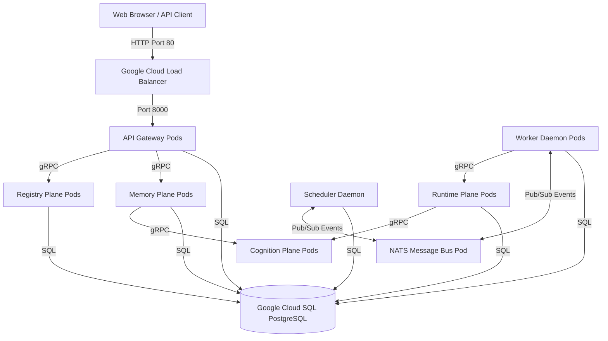

# Deploying AgentOS on Google Cloud Platform (GCP)

This guide walks you through deploying the production-ready AgentOS distributed microservices cluster onto **Google Kubernetes Engine (GKE)** with **Google Cloud SQL (PostgreSQL)** and **Google Artifact Registry (GAR)**.

---

## Architecture Overview



---

## Step 1: Prerequisites & GCP Project Setup

1. Install the [Google Cloud SDK](https://cloud.google.com/sdk/docs/install) and `kubectl`.
2. Authenticate and configure your active project:
   ```bash
   gcloud auth login
   gcloud config set project <YOUR_PROJECT_ID>
   ```
3. Enable the required GCP service APIs:
   ```bash
   gcloud services enable \
       container.googleapis.com \
       artifactregistry.googleapis.com \
       sqladmin.googleapis.com
   ```

---

## Step 2: Provision Google Cloud SQL (PostgreSQL)

1. Create a Cloud SQL for PostgreSQL instance:
   ```bash
   gcloud sql instances create agentos-db \
       --database-version=POSTGRES_15 \
       --tier=db-custom-1-3840 \
       --region=us-central1
   ```
2. Create a database named `agentos` and set a secure user password:
   ```bash
   gcloud sql databases create agentos --instance=agentos-db
   gcloud sql users set-password postgres \
       --instance=agentos-db \
       --password=YOUR_SECURE_PASSWORD
   ```
3. Record the Private/Public Connection IP of your Cloud SQL instance. Your database connection string will look like:
   `postgresql://postgres:YOUR_SECURE_PASSWORD@<CLOUDSQL_IP>:5432/agentos`

---

## Step 3: Configure Google Artifact Registry (GAR)

1. Create a Docker repository in Artifact Registry to hold your unified AgentOS image:
   ```bash
   gcloud artifacts repositories create agentos \
       --repository-format=docker \
       --location=us-central1 \
       --description="AgentOS Docker repository"
   ```
2. Configure your local Docker daemon to authenticate requests to Google Artifact Registry:
   ```bash
   gcloud auth configure-docker us-central1-docker.pkg.dev
   ```

---

## Step 4: Build and Push Docker Images

1. Build and tag the unified Docker container:
   ```bash
   docker build -t us-central1-docker.pkg.dev/<YOUR_PROJECT_ID>/agentos/agentos-core:latest .
   ```
2. Push the tagged image to your Google Artifact Registry:
   ```bash
   docker push us-central1-docker.pkg.dev/<YOUR_PROJECT_ID>/agentos/agentos-core:latest
   ```

*Note: If you change your project ID or repository path, remember to update the `image:` paths in [k8s/planes.yaml](file:///d:/agentOS/k8s/planes.yaml), [k8s/daemons.yaml](file:///d:/agentOS/k8s/daemons.yaml), and [k8s/api-gateway.yaml](file:///d:/agentOS/k8s/api-gateway.yaml).*

---

## Step 5: Provision GKE Cluster & Deploy Manifests

1. Provision a GKE Kubernetes cluster (3 nodes standard sizing):
   ```bash
   gcloud container clusters create agentos-cluster \
       --region=us-central1 \
       --num-nodes=3 \
       --machine-type=e2-standard-2
   ```
2. Acquire GKE cluster credentials for `kubectl`:
   ```bash
   gcloud container clusters get-credentials agentos-cluster --region=us-central1
   ```
3. Create the `agentos` namespace:
   ```bash
   kubectl apply -f k8s/namespace.yaml
   ```
4. Create the Kubernetes Secrets holding your database connection string and LLM API credentials:
   ```bash
   kubectl create secret generic agentos-secrets \
       --namespace=agentos \
       --from-literal=database-url="postgresql://postgres:YOUR_SECURE_PASSWORD@<CLOUDSQL_IP>:5432/agentos" \
       --from-literal=openai-api-key="sk-..." \
       --from-literal=gemini-api-key="AIza..." \
       --from-literal=anthropic-api-key="sk-ant-..."
   ```
5. Apply the rest of the manifests to spin up NATS, all service planes, and background scheduler/workers:
   ```bash
   kubectl apply -f k8s/
   ```

---

## Step 6: Verify Deployment & Public Access

1. Inspect that all pods have spun up successfully:
   ```bash
   kubectl get pods -n agentos
   ```
2. Retrieve the public external IP address generated by the Google Cloud Load Balancer:
   ```bash
   kubectl get service api-gateway -n agentos
   ```
   *Output Example:*
   ```text
   NAME          TYPE           CLUSTER-IP    EXTERNAL-IP     PORT(S)        AGE
   api-gateway   LoadBalancer   10.48.10.85   35.224.12.94    80:8000/TCP    2m
   ```
3. Open your browser and navigate to:
   `http://<EXTERNAL-IP>` (e.g. `http://35.224.12.94`)
   
Your AgentOS Observability Dashboard is now live and fully operational on Google Cloud Platform!
